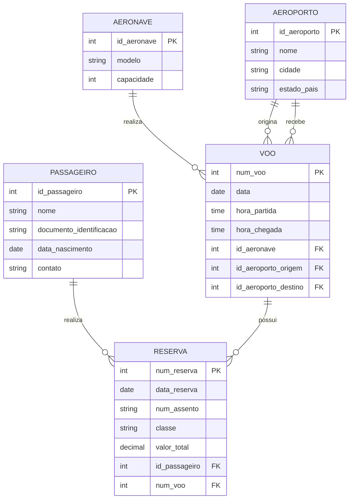

# Sistema de Reserva de Passagens Aéreas

## 👥 Equipe

**Projeto:** Sistema de Reserva de Passagens Aéreas

**Integrantes:**

* João Gabriel
* Allan Vyctor
* João Henrique
* Micaías Tavares

**Turma:** Infoweb 2V

---

## 💻 Sobre o projeto

O Sistema de Reserva de Passagens Aéreas foi desenvolvido com o objetivo de centralizar e organizar as informações relacionadas às viagens, passageiros, aeronaves, aeroportos e reservas de uma companhia aérea.

O sistema foi pensado para atender às necessidades da **AeroBrasil Linhas Aéreas**, empresa responsável pelo transporte de passageiros entre diferentes cidades do Brasil e do exterior. Com o crescimento da quantidade de voos e passageiros, tornou-se necessário organizar de forma mais eficiente as informações utilizadas no processo de atendimento e gerenciamento das reservas.

A proposta do projeto é disponibilizar uma estrutura de dados capaz de armazenar e relacionar as principais informações das operações da companhia, permitindo que os funcionários consultem os voos, passageiros e reservas de maneira centralizada.

---

## 🎯 Objetivo

O principal objetivo do sistema é facilitar o gerenciamento das reservas de passagens aéreas, organizando as informações dos passageiros, voos, aeronaves, aeroportos e reservas em um único sistema.

Com essa estrutura, pretende-se melhorar o controle das viagens, da ocupação das aeronaves e das reservas realizadas pelos passageiros.

---

## ✈️ Cenário de utilização

A AeroBrasil Linhas Aéreas realiza voos entre diferentes aeroportos e precisa manter organizadas as informações relacionadas às suas operações.

Cada passageiro possui um cadastro com suas informações pessoais e pode realizar várias reservas ao longo do tempo. Cada reserva está relacionada a um único passageiro e a um único voo.

Os voos possuem informações como número de identificação, data, horário de partida e horário previsto de chegada. Cada voo possui um aeroporto de origem e um aeroporto de destino e é realizado por uma única aeronave.

Os aeroportos possuem identificador, nome, cidade e estado ou país, podendo participar de diversos voos como origem ou destino.

As aeronaves possuem identificador, modelo e capacidade de passageiros. Uma mesma aeronave pode ser utilizada em diferentes voos ao longo do tempo.

As reservas armazenam informações como data da reserva, número do assento, classe da passagem e valor total pago.

Dessa forma, o sistema permite centralizar as informações das viagens e auxiliar os funcionários no controle dos passageiros, voos e reservas.

---

## ⭐ Principais características

O sistema será estruturado para permitir o gerenciamento de:

* **Passageiros:** cadastro e identificação dos passageiros;
* **Voos:** controle das viagens realizadas pela companhia;
* **Aeronaves:** registro das aeronaves utilizadas nos voos;
* **Aeroportos:** armazenamento dos locais de origem e destino;
* **Reservas:** registro das reservas realizadas pelos passageiros;
* **Relacionamentos:** associação entre passageiros, reservas, voos, aeronaves e aeroportos.

---

## 🗄️ Modelo lógico do banco de dados

O banco de dados é composto por cinco relações principais:

### PASSAGEIRO

Armazena os dados dos passageiros cadastrados.

* `id_passageiro` — chave primária
* `nome`
* `documento_identificacao`
* `data_nascimento`
* `contato`

### AERONAVE

Armazena os dados das aeronaves utilizadas pela companhia.

* `id_aeronave` — chave primária
* `modelo`
* `capacidade`

### AEROPORTO

Armazena os dados dos aeroportos utilizados nas viagens.

* `id_aeroporto` — chave primária
* `nome`
* `cidade`
* `estado_pais`

### VOO

Armazena os dados de cada voo e suas relações com aeronaves e aeroportos.

* `num_voo` — chave primária
* `data`
* `hora_partida`
* `hora_chegada`
* `id_aeronave` — chave estrangeira para `AERONAVE`
* `id_aeroporto_origem` — chave estrangeira para `AEROPORTO`
* `id_aeroporto_destino` — chave estrangeira para `AEROPORTO`

### RESERVA

Armazena os dados das reservas realizadas pelos passageiros.

* `num_reserva` — chave primária
* `data_reserva`
* `num_assento`
* `classe`
* `valor_total`
* `id_passageiro` — chave estrangeira para `PASSAGEIRO`
* `num_voo` — chave estrangeira para `VOO`

---

## 📊 Diagrama ER



---

## 🔗 Relacionamentos

O modelo lógico apresenta os seguintes relacionamentos:

* Um **passageiro** pode realizar nenhuma ou várias reservas, enquanto cada **reserva** pertence a exatamente um passageiro.
* Um **voo** pode possuir nenhuma ou várias reservas, enquanto cada **reserva** está vinculada a exatamente um voo.
* Uma **aeronave** pode ser utilizada em nenhum ou vários voos, enquanto cada **voo** é realizado por exatamente uma aeronave.
* Um **aeroporto** pode ser origem de nenhum ou vários voos, enquanto cada **voo** possui exatamente um aeroporto de origem.
* Um **aeroporto** pode receber nenhum ou vários voos, enquanto cada **voo** possui exatamente um aeroporto de destino.

As duas relações entre `AEROPORTO` e `VOO` são representadas separadamente porque o aeroporto exerce dois papéis diferentes: **origem** e **destino**.

---

## 📌 Estrutura das relações

```text
PASSAGEIRO(
    id_passageiro PK,
    nome,
    documento_identificacao,
    data_nascimento,
    contato
)

AERONAVE(
    id_aeronave PK,
    modelo,
    capacidade
)

AEROPORTO(
    id_aeroporto PK,
    nome,
    cidade,
    estado_pais
)

VOO(
    num_voo PK,
    data,
    hora_partida,
    hora_chegada,
    id_aeronave FK,
    id_aeroporto_origem FK,
    id_aeroporto_destino FK
)

RESERVA(
    num_reserva PK,
    data_reserva,
    num_assento,
    classe,
    valor_total,
    id_passageiro FK,
    num_voo FK
)
```

---

## 🚀 Próximas etapas

Este repositório servirá como base para as próximas etapas do desenvolvimento do sistema.

A documentação e o modelo lógico poderão ser atualizados posteriormente caso ocorram alterações na estrutura ou nas funcionalidades do projeto durante a implementação.
